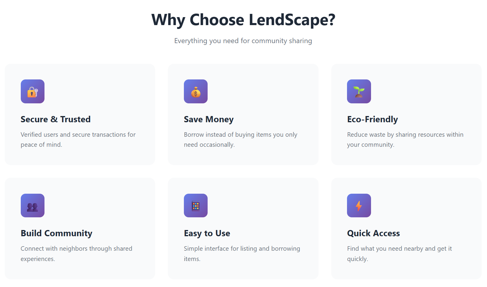
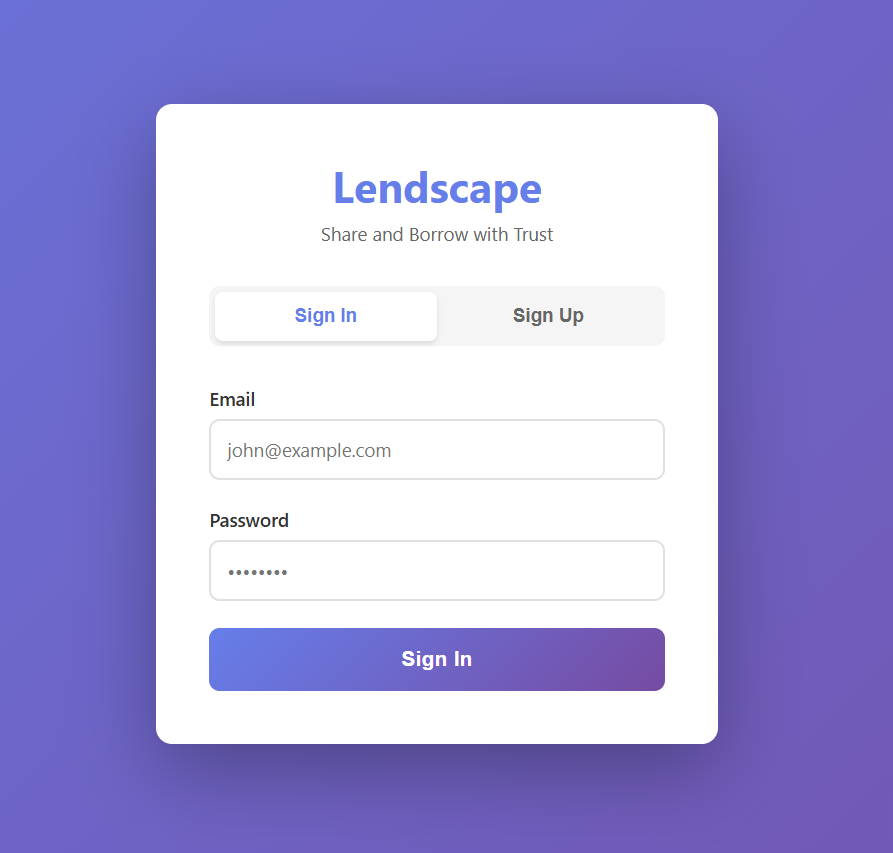
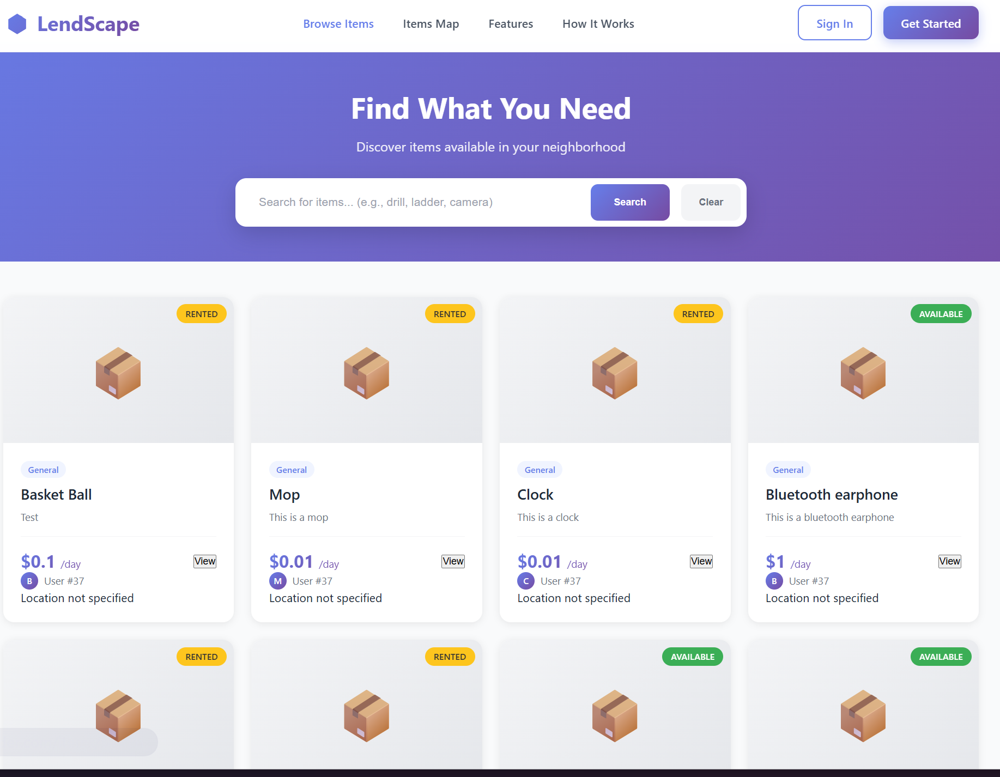

# DS5110 Course Project - LendScape

A peer-to-peer lending and rental platform that connects people who want to lend items with those who need to borrow them.

See a runnable demo here: https://lendscape.onrender.com

## Course Information

**Date**: FALL 2025

**Course**: DS5110: Essentials of Data Science

## Project Overview

LendScape is a community-driven marketplace that makes it easy and safe to share resources. Instead of buying items you'll only use occasionally, you can borrow them from neighbors and local community members. Item owners can share things they're not using, while borrowers save money and reduce waste.

The platform handles the entire rental process - from browsing and booking to reviews - creating a trusted environment for peer-to-peer transactions.

## Key Features

#### For Borrowers

- **Browse Local Items** - Search for items available in your area
- **Verified Listings** - See photos, descriptions, and availability
- **User Reviews** - Read ratings and feedback from previous renters

#### For Lenders

- **List Your Items** - Create listings with photos and set availability
- **Manage Availability** - Set when items are available for rent
- **Share Resources** - Help your community by lending items you're not using
- **Build Reputation** - Gain trust through positive reviews

#### Platform Features

- **User Verification** - Multi-step verification process for safety
- **Location-Based Search** - Find items near you
- **Rating System** - Two-way reviews for lenders and borrowers
- **Order Management** - Track rental status from booking to return

## Tech Stack

- Backend: Flask, Python 3.x
- Database: PostgreSQL
- Frontend: HTML/CSS/JavaScript
 - Deployment: render.com

## Dependencies

See requirements.txt

## How to launch the App

Command line and how to deploy on render.com:

Run the following code or put the code in "start command"

```
python run.py
```

And then visit the url in the console(typically with port 5000) or the link provided by render.com(For example, https://lendscape.onrender.com for this repository.). To make the app open to the Internet, "host" in run.py needs to be "0.0.0.0" to make all ports eligible to run this app

## Screenshots
See ./imgs







